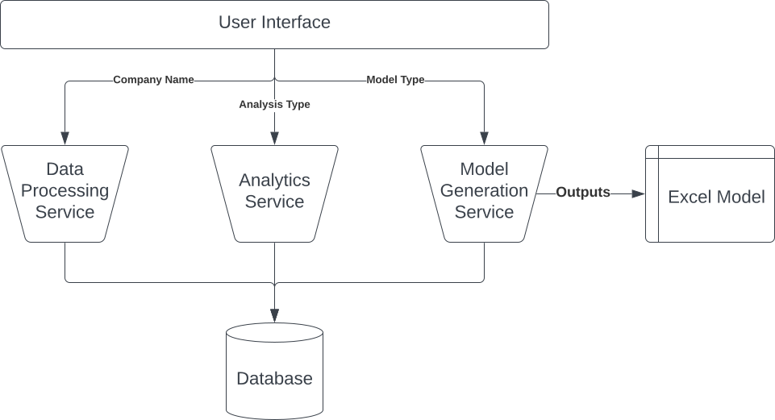
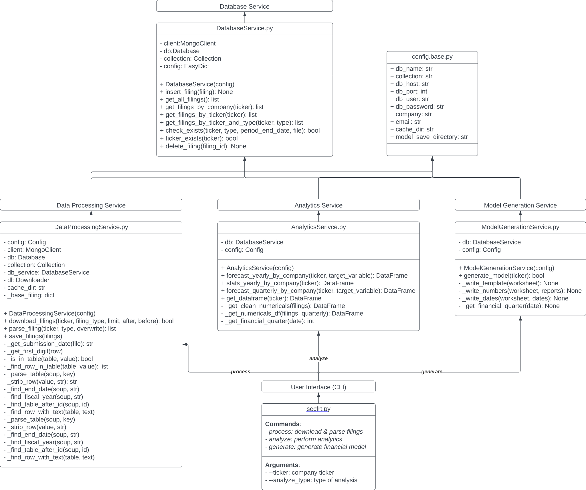
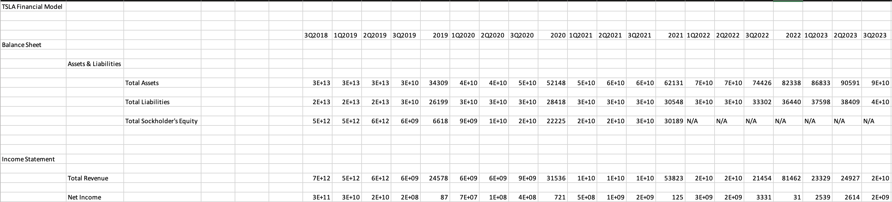

# CS7319 Final Project Group 2 Eli Laird
## Automatic SEC Filing Retrieval Tool

> The SEC Filing Retrieval Tool is a command-line interface (CLI) designed to manage and analyze SEC filings for a given company using various commands.

### Selected Architecture Design
__Key Services:__

- _Data Processing Service:_
  - Locates, downloads, extracts, and stores SEC filings in a database.
- _Analytics Service:_
  - Performs statistical analysis and forecasting on processed financial data.
- _Model Generation Service:_
  - Formats data and analytics into user-specific financial models.

- __Advantages:__
  - _Independence_: Individual execution of extraction, analytics, or model generation.
  - _User Control:_ Flexible user interface for service selection.
  - _Customization_: Tailors financial model format as per user's specifications.
- __Impact:__
  - _Enhanced Flexibility_: Enables selective execution and customization.
  - _Simplified Workflow_: Streamlines data extraction, analytics, and model creation.



### Selected Architecture UML Diagram


## Changes From Proposal
- In the proposal, I planned on reading the SEC filings from an RSS feed. This proved to be more difficult than expected, so I decided to use a package named `sec_edgar_downloader` [repo](https://github.com/jadchaar/sec-edgar-downloader) to download the html files for each company. I then used the BeautifulSoup python package to manually parse the tables from the html files.
- I also provided an example of a financial model that had many different values. I simplified the model to only include values that were consistent across company reports. This made the model easier to read and understand (as shown in example at the bottom of this page).

### Comparison Between Selected (Service-based) and Alternative Designs (Pipeline)
__Pipeline Architecture:__
  - _Sequential Data Handling:_ The data flow is segmented into different components or stages, each responsible for specific processing steps, resulting in a sequential flow.
    - _Limited Flexibility:_ The execution of services is streamlined and fixed within the defined sequence, providing limited adaptability for users to define service selections or modify the pipeline's flow.

__Service-Based Architecture (Favored):__
  - _Independent Service Execution:_ Services are executed independently, allowing for more flexible selections by users based on their needs.
  - _Customization and Tailored Functionalities:_ Offers the ability to tailor financial model formats and functionalities based on user-specific requirements.
  - _Greater Flexibility and Adaptability:_ Provides more flexibility in selecting services and tailoring functionalities as per user-specific needs.

__Rationale for Choosing the Service-based Architecture:__
  - _Adaptability to User-specific Needs:_ The Service-based Architecture provides greater adaptability by allowing tailored functionalities and varied functionalities catering to user requirements.
  - _Flexible and Independent Execution:_ Users can leverage the independent execution of services for a wide range of functionalities, thereby enhancing the tool's flexibility and adaptability.

>The Service-based Architecture was preferred due to its capacity to offer tailored functionalities and flexibility in executing services according to diverse user demands. This flexibility and adaptability make it a more suitable choice for accommodating the varied requirements of users using the SEC Filing Retrieval Tool.

### Requirements 
- Python 3.10
- Conda 23.3.1
- Docker 24.0.6
- Docker Compose 2.23.0

### Intsallation

#### Docker
1. [Install Docker](https://docs.docker.com/engine/install/)
2. [Install Docker Compose](https://docs.docker.com/compose/install/)

#### Python Environment
1. Clone the repository
   - `git clone <repo>`
2. Create conda environment
    - `conda create --name secdoc python=3.10`
3. Activate conda environment
    - `conda activate secdoc`
4. Install requirements
    - `pip install -r requirements.txt`
    - `conda install -y lxml`

#### MongoDB Setup
1. `docker-compose up -d`

### Usage

```bash
python secfrt.py <command> [-t/--ticker <ticker>] [-a/--analysis_type <analysis_type>]
```

## Available Commands

1. **process**: Processes and saves the SEC filings of a specific company.
   - **Arguments**:
     - `-t, --ticker`: Ticker symbol of the company.
   - **Example**:
     ```bash
     python secfrt.py process -t TSLA
     ```

2. **analyze**: Analyzes SEC filings for forecasting or statistics.
   - **Arguments**:
     - `-t, --ticker`: Ticker symbol of the company.
     - `-a, --analysis_type`: Type of analysis (`forecast_yearly`, `forecast_quarterly`, `stats_yearly`, or `dataframe`).
   - **Example**:
     ```bash
     python secfrt.py analyze -t TSLA -a forecast_yearly
     ```

3. **generate**: Generates a financial model based on the SEC filings.
   - **Arguments**:
     - `-t, --ticker`: Ticker symbol of the company.
   - **Example**:
     ```bash
     python secfrt.py generate -t TSLA
     ```

## Command Details

- **process**:
  - Downloads yearly (10-K) and quarterly (10-Q) reports for the specified company (`-t/--ticker`).
  - Processes the filings and saves them to the database.
  
- **analyze**:
  - Supports different types of analysis:
    - `forecast_yearly`: Forecast yearly data for a specific metric.
    - `forecast_quarterly`: Forecast quarterly data for a specific metric.
    - `stats_yearly`: Calculate statistics aggregated over years.
    - `dataframe`: Retrieve a dataframe of the filings' data.
  - Results are printed in the console.

- **generate**:
  - Generates a financial model for the specified company (`-t/--ticker`).
  - The model is saved as an Excel file in the configured model save directory.


## Example Model

